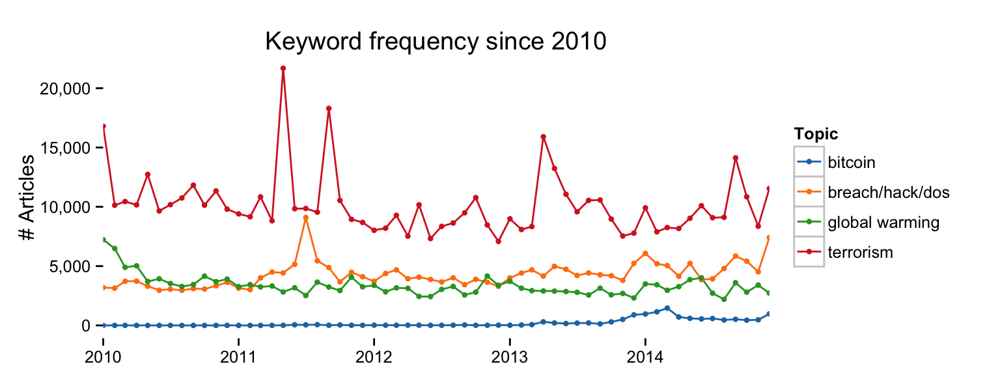

newsfreq is a package that provides access to the newsfreq.com API, which enables searching media sources for keywords in news articles.

The following functions are implemented:

-   `news_search` - search for articles

The following data sets are included:

### News

-   Version `0.1` released

### Installation

``` r
devtools::install_github("hrbrmstr/newsfreq")
```

### Usage

``` r
library(newsfreq)

# current verison
packageVersion("newsfreq")
```

    ## [1] '0.1'

``` r
library(newsfreq)
library(ggplot2)
library(scales)
library(dplyr)
```

    ## 
    ## Attaching package: 'dplyr'
    ## 
    ## The following object is masked from 'package:stats':
    ## 
    ##     filter
    ## 
    ## The following objects are masked from 'package:base':
    ## 
    ##     intersect, setdiff, setequal, union

``` r
library(tidyr)
library(ggthemes)
```

``` r
breach <- news_search(keywords="(data breach) OR hacking OR (denial of service)",
                      date_from="2010-01-01", date_to="2014-01-31")
head(breach)
```

    ##    date_from    date_to year month_abb month count search_date                                    search_terms
    ## 1 2010-01-01 2010-01-31 2010       Jan    01  3197  2015-01-31 (data breach) OR hacking OR (denial of service)
    ## 2 2010-02-01 2010-02-28 2010       Feb    02  3140  2015-01-31 (data breach) OR hacking OR (denial of service)
    ## 3 2010-03-01 2010-03-31 2010       Mar    03  3721  2015-01-31 (data breach) OR hacking OR (denial of service)
    ## 4 2010-04-01 2010-04-30 2010       Apr    04  3732  2015-01-31 (data breach) OR hacking OR (denial of service)
    ## 5 2010-05-01 2010-05-31 2010       May    05  3307  2015-01-31 (data breach) OR hacking OR (denial of service)
    ## 6 2010-06-01 2010-06-30 2010       Jun    06  2964  2015-01-31 (data breach) OR hacking OR (denial of service)

``` r
breach %>%
  mutate(search_terms="breach/hack/dos") -> breach

terrorism <- news_search(keywords="terrorism",
                   date_from="2010-01-01", date_to="2014-01-31")

warming <- news_search(keywords="global warming",
                   date_from="2010-01-01", date_to="2014-01-31")

bitcoin <- news_search(keywords="bitcoin",
                       date_from="2010-01-01", date_to="2014-01-31")

bind_rows(breach, terrorism, warming, bitcoin) %>%
  select(date_from, search_terms, count) -> combined
```

``` r
gg <- ggplot(combined, aes(x=date_from, y=count, group=search_terms))
gg <- gg + geom_line(aes(color=search_terms))
gg <- gg + geom_point(aes(color=search_terms), size=1.5)
gg <- gg + scale_x_date(breaks=date_breaks("year"),
                        labels=date_format("%Y"), expand=c(0,0))
gg <- gg + scale_y_continuous(label=comma)
gg <- gg + scale_color_tableau(name="Topic")
gg <- gg + labs(x=NULL, y="# Articles", title="Keyword frequency since 2010")
gg <- gg + theme_bw()
gg <- gg + theme(panel.grid=element_blank())
gg <- gg + theme(panel.border=element_blank())
gg
```



### Test Results

``` r
library(newsfreq)
library(testthat)

date()
```

    ## [1] "Sat Jan 31 11:42:15 2015"

``` r
test_dir("tests/")
```

    ## basic functionality :
